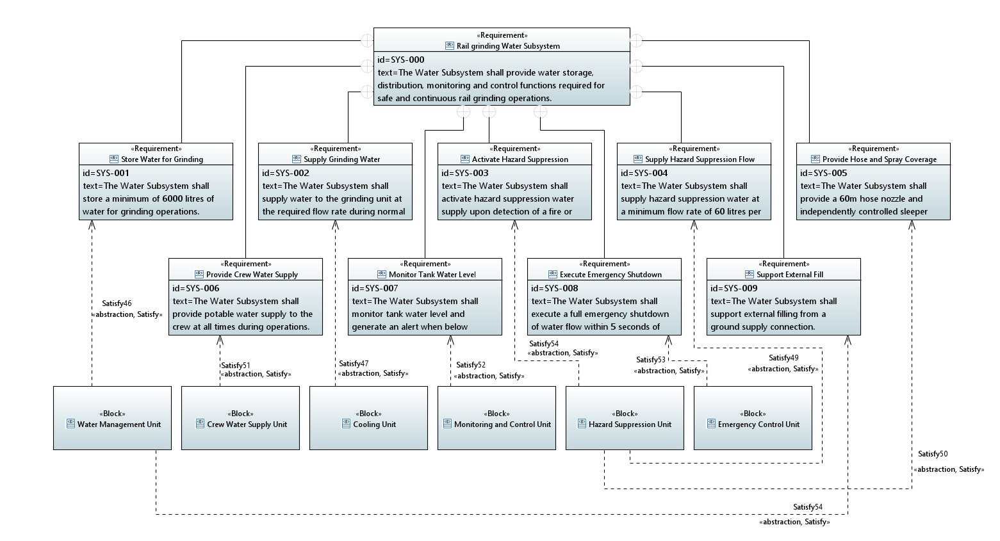
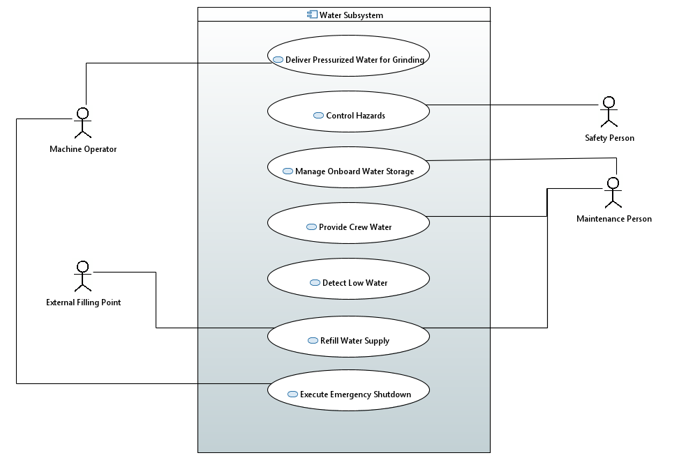
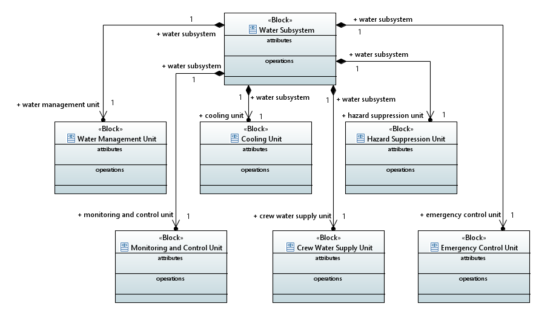
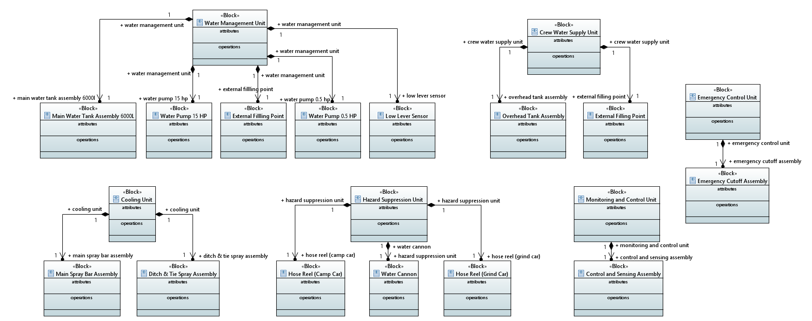
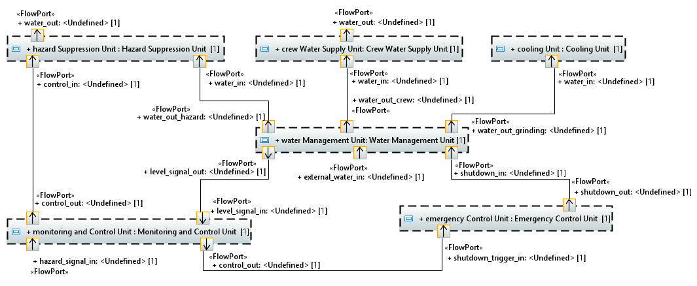
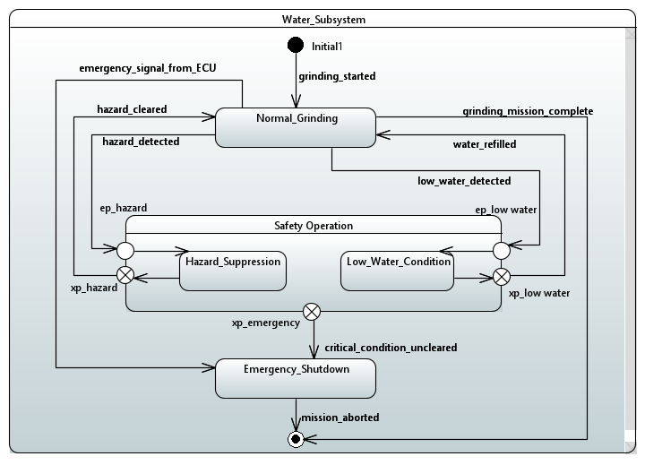
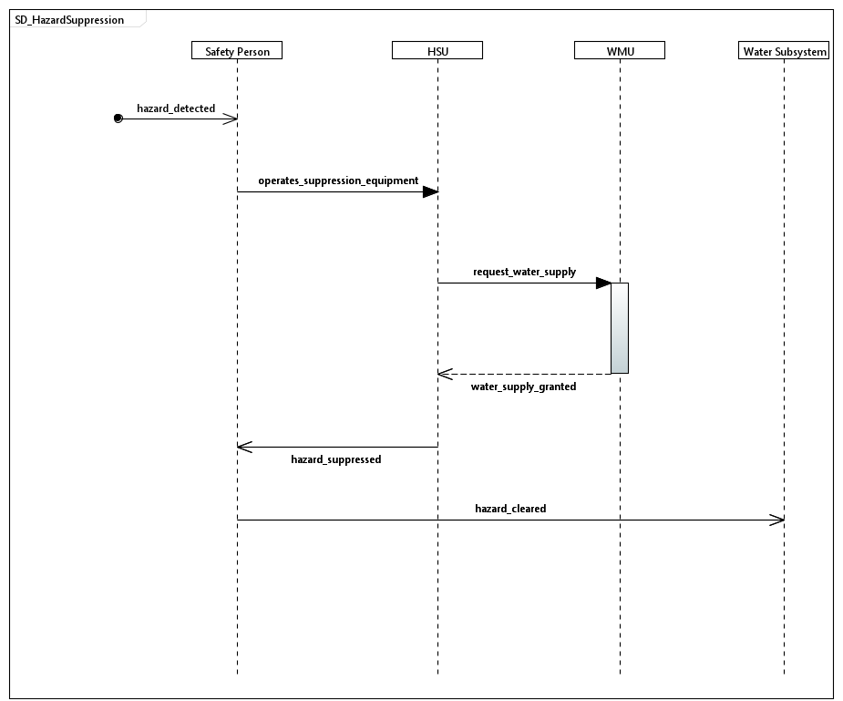
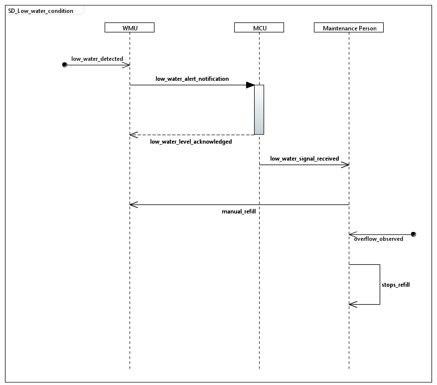
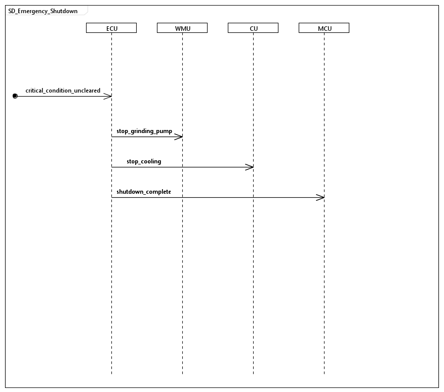

# Rail Grinding Machine — Water Subsystem (MBSE Portfolio Project)

A complete Model-Based Systems Engineering demonstration — from requirements to behavioural verification — for a safety-relevant subsystem of a rail grinding machine.

**Tools:** SysML 1.6 · Papyrus · IBM DOORS Next Generation · Capella (Arcadia)

## Why This Project Exists

This portfolio emphasizes engineering decisions, traceability, and architectural reasoning in addition to SysML diagrams. The project follows the systems engineering lifecycle defined in ISO/IEC/IEEE 15288, covering requirements definition, architecture definition, behavioural modelling, and traceability.

This project models the Water Subsystem of a rail grinding machine: a system responsible for supplying cooling water to the grinding process, suppressing fire/spark hazards generated by grinding, and maintaining crew water supply — all under strict safety and response-time constraints.

It was built to demonstrate practical, tool-grounded MBSE competency for Systems Engineer / MBSE Engineer roles, using toolchains commonly adopted in rail, aerospace, automotive, and industrial systems engineering.

## Toolchain

| Discipline | Tool | Standard |
|---|---|---|
| Requirements Management | IBM DOORS Next Generation | — |
| System Modelling (SysML) | Eclipse Papyrus | SysML 1.6 |
| System Architecture (Arcadia) | Capella | Arcadia Methodology |
| Traceability | Manual RTM (Requirements Traceability Matrix) | — |

A deliberate scoping decision: DOORS Next and Papyrus are demonstrated as independent, best-practice-representative tools rather than integrated via a live OSLC bridge. In most real programs, these tools are connected — but standing up an OSLC bridge is an infrastructure exercise, not a systems engineering one. Traceability here is enforced manually via a documented RTM, which is the more common practice in early-stage or tool-transition programs anyway, and keeps the focus on modelling rigor rather than integration plumbing.

## Methodology Journey: Capella → Papyrus

This subsystem was first developed as a complete Arcadia-based case study in Capella, covering Operational Analysis, System Analysis, Logical Architecture, and Physical Architecture, with full requirements-to-verification traceability (see full documentation: [Documentation_RailGrinding_Machine_Water_Subsystem_V1_0.docx](./capella/Documentation_RailGrinding_Machine_Water_Subsystem_V1_0.docx), included in this repo).

The architecture was then redeveloped in SysML 1.6 using Papyrus, formalizing requirements management in IBM DOORS Next Generation and extending behavioural depth through detailed State Machine and Sequence Diagram modelling.

Together, they demonstrate the ability to apply equivalent architectural reasoning across both Arcadia and SysML. Working across both also reinforced consistent architectural decisions independently arrived at in each methodology — for example, both models isolate emergency/safety behaviour into a dedicated control unit rather than folding it into routine monitoring, and both separate cooling from hazard suppression despite both being "water delivery" functions on the surface.

## System Overview

The Water Subsystem has four operational concerns, each with distinct actors and distinct levels of automation:

| Concern | Behaviour | Automation Level |
|---|---|---|
| Normal Grinding Cooling | Continuous water supply to the grinding unit | Fully automated |
| Hazard Suppression | Fire/spark detection and suppression | Fully manual — human-detected, human-operated, human-cleared |
| Low Water Condition | Tank monitoring, alerting, manual refill | Automated detection, manual response |
| Emergency Shutdown | System-wide shutdown on unresolved critical condition | Fully automated escalation |

This mix is intentional and mirrors real rail machinery: not every safety function is a sensor-actuator loop. A core engineering decision in this project was recognizing that the Hazard Suppression function has zero automatic sensors — a human visually detects the hazard, manually operates the suppression equipment, and manually confirms clearance. Modelling this honestly (rather than defaulting to an idealized automatic response) is one of the more realistic aspects of this portfolio.

## Assumptions and Scope

### Scope

- Focus is limited to the onboard Water Subsystem of the rail grinding machine — interfaces to other onboard subsystems (grinding unit, propulsion, ECU logic internals) are modelled only at the interface/port level, not decomposed internally.
- Dust suppression is not addressed as a distinct system requirement in this iteration. The Water Subsystem's hazard suppression capability (SYS-003, SYS-004) is scoped to fire/heat detection and response.
- Mechanical design calculations (tank structural design, pump sizing, pipe stress analysis) are outside the scope of this model.
- Hydraulic sizing (flow rates, pressures, hose diameters) is represented only where explicitly stated in a requirement (e.g., SYS-004's 60 L/min minimum) — detailed hydraulic calculations are not performed.
- The Emergency Control Unit (ECU), Water Management Unit (WMU), Monitoring and Control Unit (MCU), and Cooling Unit (CU) are modelled as logical/physical blocks with defined interfaces and behaviour; internal control-software logic (e.g., PLC ladder logic, firmware) is not modelled.
- DOORS Next and Papyrus are demonstrated as independent tools without a live OSLC bridge (see Toolchain section) — this is a deliberate scoping decision, not an integration gap.

### Assumptions

- All sensor and actuator interfaces are assumed to operate nominally; sensor failure modes, fault detection, and diagnostic coverage are not modelled (no FMEA/FTA was performed as part of this exercise).
- Environmental conditions (temperature extremes, vibration, EMC) affecting component selection are assumed to be handled at the physical component specification level and are not represented in the behavioural model.
- The rail grinding machine's host platform (chassis, propulsion, power supply) is treated as a black-box provider of power and structural mounting to the Water Subsystem; its internal design is out of scope.
- Human actors (Safety Person, Maintenance Person, Machine Operator) are assumed to follow defined operational procedures correctly; human-error modelling and training/SOP documentation are not part of this model.
- Cybersecurity considerations for the Monitoring and Control Unit are out of scope for this iteration.

## Architecture Flow
Stakeholder Need
↓
System Requirements (DOORS)
↓
Use Cases
↓
Logical Architecture
↓
Physical Architecture
↓
Behaviour (State Machine + Sequence Diagrams)
↓
Verification (RTM)
## Diagram Suite

All diagrams are modelled in Papyrus. Full-resolution PNG exports and the native model files are included in this repo under `/diagrams` and `/model`.

| Diagram | Purpose |
|---|---|
| REQ | Requirements diagram — visual anchor for SYS-001–009 |
| UC | Use Case diagram — actor/system interaction scope |
| BDD_Logical | Logical block decomposition (function-level) |
| BDD_Physical | Physical block decomposition (component-level) |
| IBD | Internal Block Diagram — port/interface connectivity |
| STM | State Machine — full operational + safety state logic |
| SD_HazardSuppression | Manual hazard detection → suppression → clearance |
| SD_LowWaterCondition | Automated tank monitoring → manual refill → confirmation |
| SD_EmergencyShutdown | Automated, substate-agnostic critical escalation path |

## Requirements Traceability Matrix (RTM)

Nine system requirements (SYS-001–SYS-009), managed in DOORS Next, each allocated to a logical block and traced to the diagram(s) that verify or demonstrate them.

| Req ID | Requirement | Verification | Allocated Block | Verifying Diagram(s) |
|---|---|---|---|---|
| SYS-001 | Store min. 6000 L of water for grinding operations | Inspection | Water Management Unit | BDD_Logical, IBD |
| SYS-002 | Supply water to grinding unit at required flow rate during normal ops | Test | Cooling Unit | BDD_Logical, IBD, STM (Normal_Grinding) |
| SYS-003 | Activate hazard suppression on fire/heat detection | Demonstration | Hazard Suppression Unit | STM (Hazard_Suppression), SD_HazardSuppression |
| SYS-004 | Supply suppression water ≥60 L/min via ≥1 water cannon, 20 m reach | Test | Hazard Suppression Unit | BDD_Physical, IBD, SD_HazardSuppression |
| SYS-005 | Provide 60 m hose + independently controlled sleeper/ditch nozzles | Inspection | Hazard Suppression Unit | BDD_Physical, IBD |
| SYS-006 | Provide potable water to crew at all times | Test | Crew Water Supply Unit | BDD_Logical, IBD |
| SYS-007 | Monitor tank level and alert below minimum threshold | Test | Monitoring and Control Unit | STM (Low_Water_Condition), SD_LowWaterCondition |
| SYS-008 | Execute full emergency shutdown within 5 seconds of trigger | Test | Emergency Control Unit | STM (Emergency_Shutdown), SD_EmergencyShutdown |
| SYS-009 | Support external filling from ground supply connection | Inspection | Water Management Unit | BDD_Physical, IBD |

**Traceability coverage note:** Every requirement with reactive, event-driven behaviour (SYS-003, 004, 007, 008) carries full STM → Sequence Diagram verification depth. SYS-002 and SYS-006 are static/continuous requirements with no discrete triggering event, so they're verified structurally (BDD/IBD) rather than behaviourally — a deliberate depth-over-breadth scoping decision, not a gap.

## Key Engineering Decisions

1. **Kept Hazard_Suppression in the system STM despite zero system-level signals.** Detection, response, and clearing are all human-performed. It would have been simpler to model this as "outside system boundary," but the state is real system behaviour — the water subsystem's water cannons and hose network are actively engaged during this state, even though a human triggers it. Modelling it honestly, with Safety Person as an actor rather than a sensor, keeps the STM representative of actual system behaviour.

2. **SD_EmergencyShutdown is deliberately substate-agnostic.** Both Hazard_Suppression and Low_Water_Condition can escalate to emergency shutdown via the same `critical_condition_uncleared` trigger. Rather than duplicating shutdown logic across two sequence diagrams, this SD is modelled generically using a found message (a message entering from the diagram frame edge, with no source lifeline) — representing an STM-originating trigger rather than a specific upstream actor. This keeps the shutdown logic single-sourced and reusable, matching how the STM itself models the escalation as a shared exit point.

3. **No sensor confirms tank refill — only human visual observation.** Maintenance Person confirms refill completion via overflow observation, not a sensor reading. This mirrors a common reality in older or cost-constrained rail machinery: not every state transition is instrumented, and the model reflects that rather than assuming idealized automation.

## Roadmap

- [x] Requirements authored in DOORS Next (SYS-001–009)
- [x] Full Arcadia case study in Capella (OA/SA/LA/PA)
- [x] REQ, UC, BDD_Logical, BDD_Physical, IBD (Papyrus)
- [x] STM
- [x] Three Sequence Diagrams, traced to STM regions
- [x] RTM finalized
- [ ] Publish written case study on modelling decisions

## About This Project

Built as a self-directed portfolio project to demonstrate hands-on MBSE competency across two methodologies — Arcadia (Capella) and SysML (Papyrus) — including requirements traceability and the kind of judgment-driven scoping decisions that don't show up in a tutorial, only in a real system.

**Toolchain:** Eclipse Papyrus (SysML 1.6) · Capella (Arcadia) · IBM DOORS Next Generation
